<!--
| | 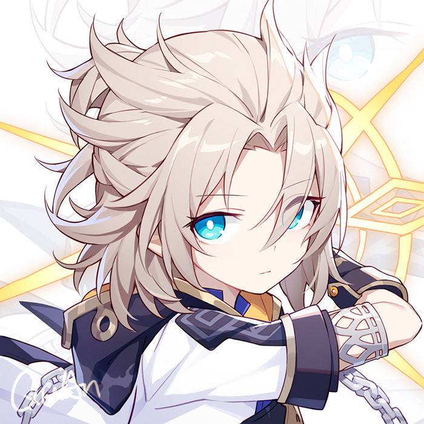 |  | 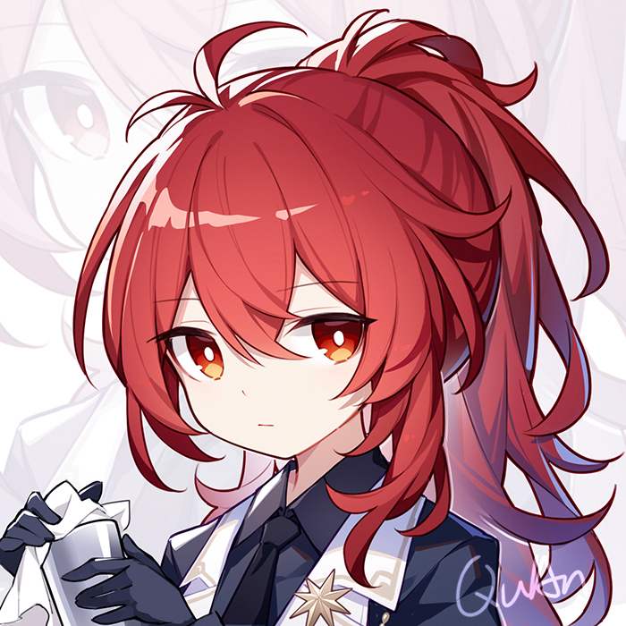|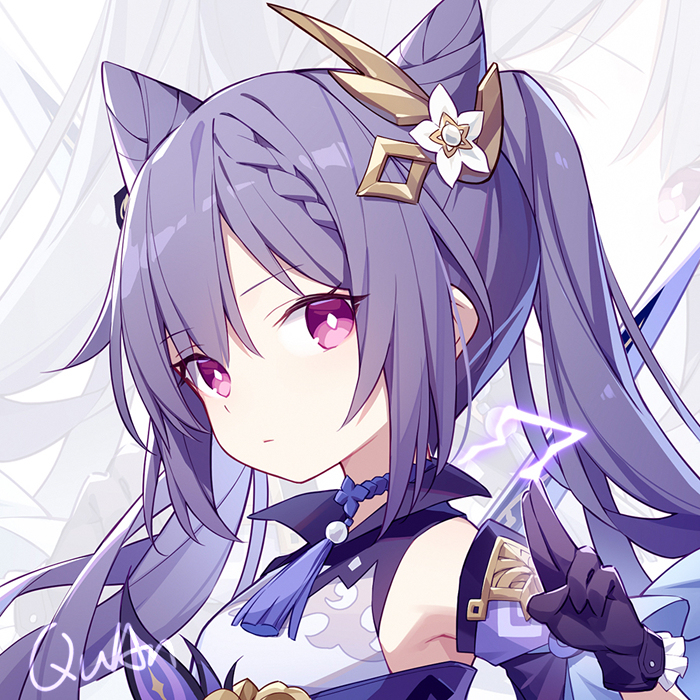
---|---|---|---|---|---
 | | |  | 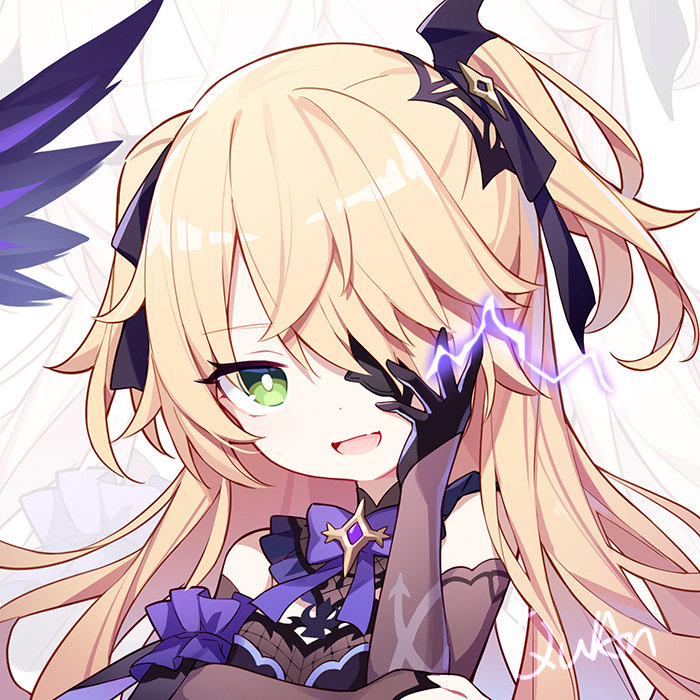 | 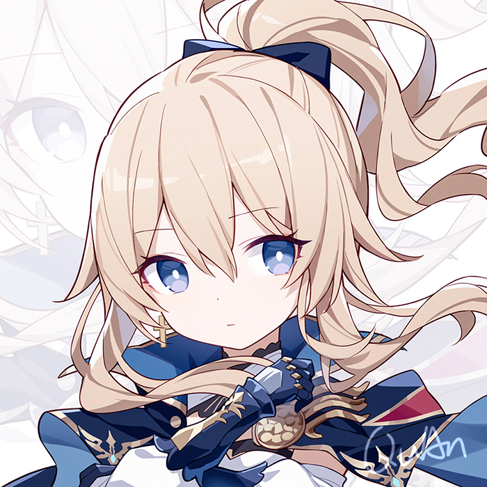
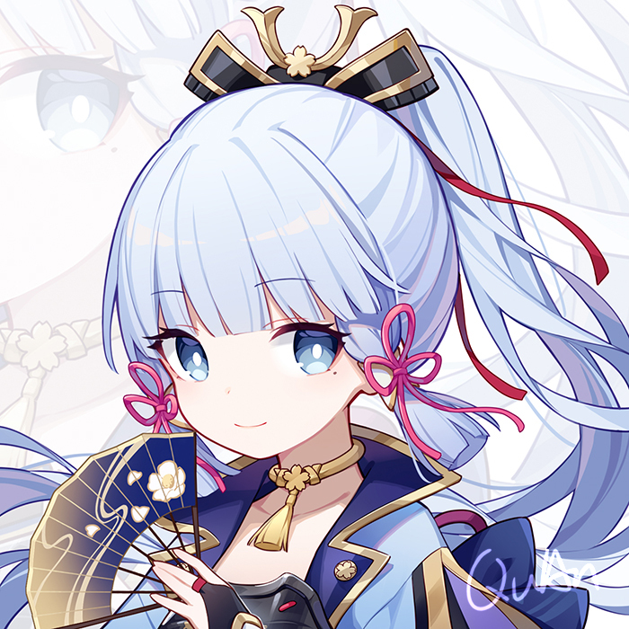| | 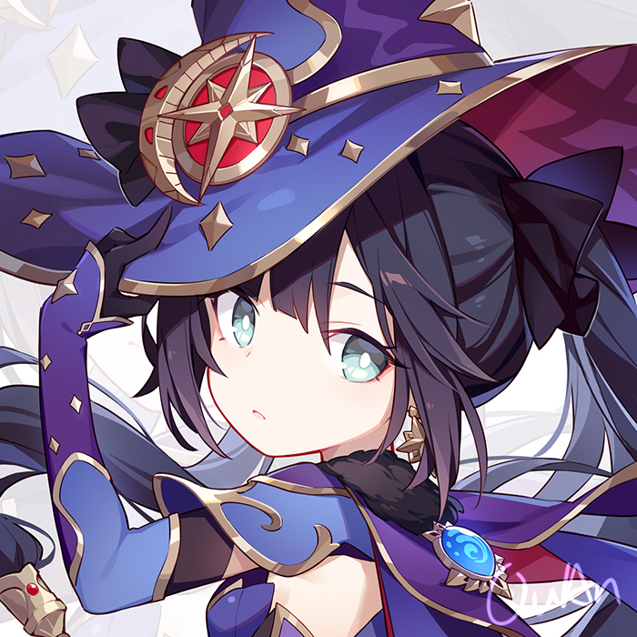 | 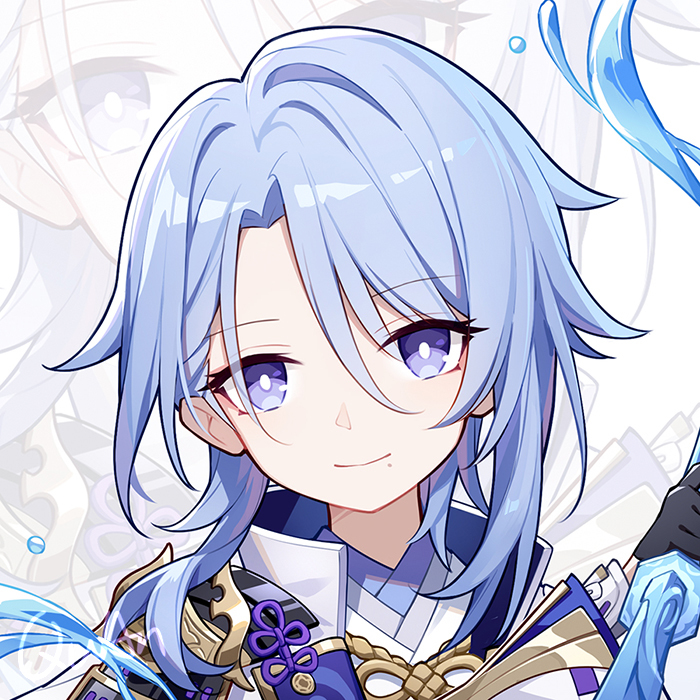 |  | 
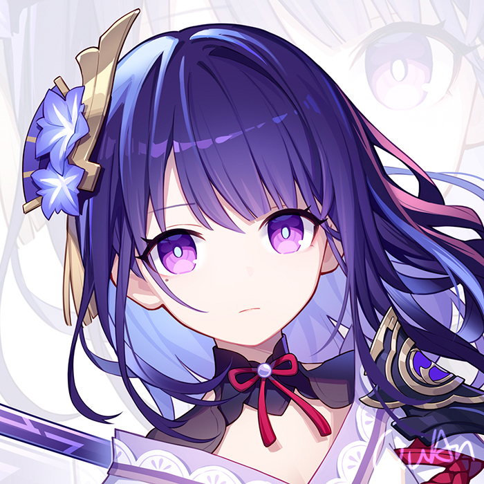|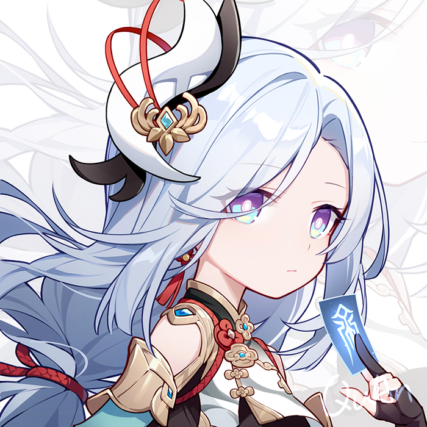 |  | 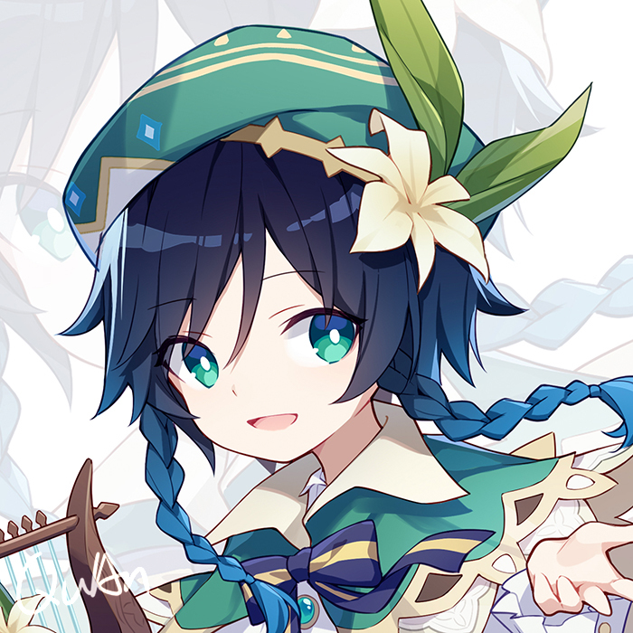|  | 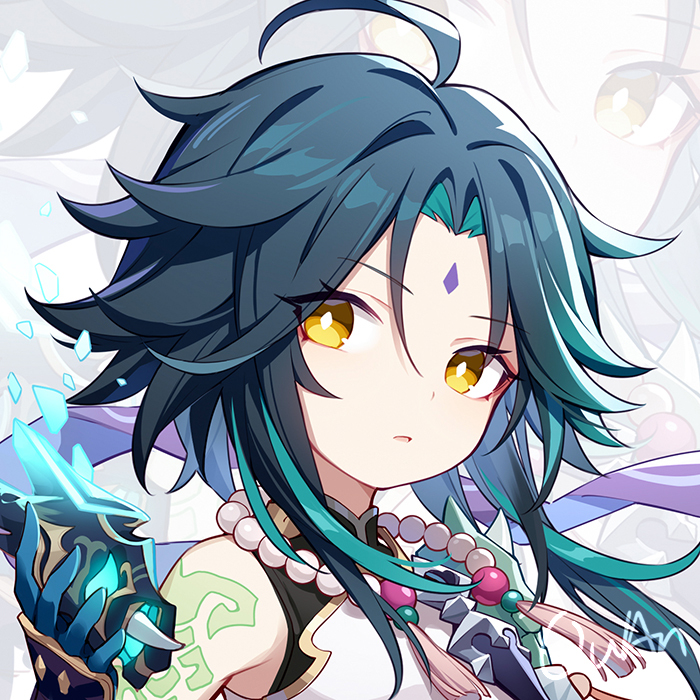
 |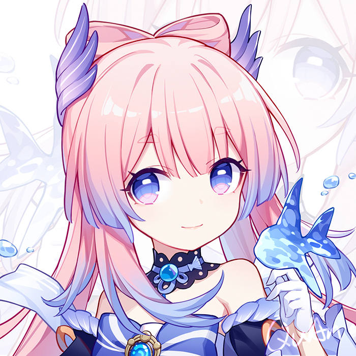 |  | | 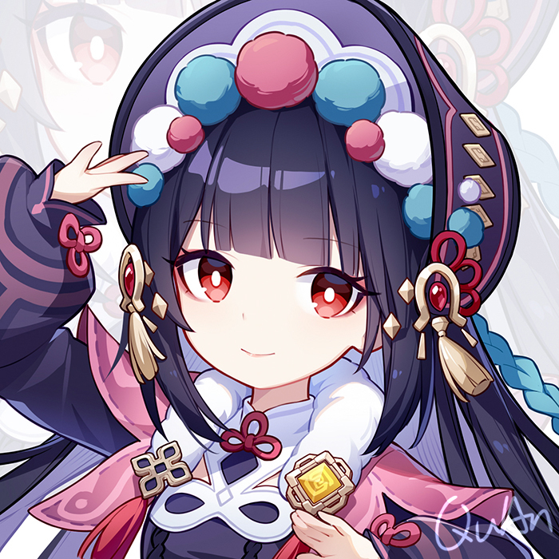 | 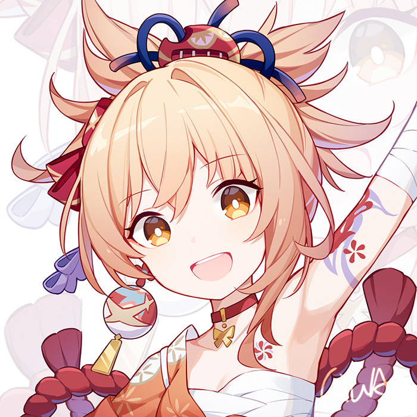
-->

<h1 align="center">👋Hi, I'm <a href="https://github.com/echo17666">echo17666</a>!</h1>
<h1 align="center">Welcome to my GitHub profile~ QAQ</h1>

<!--  -->

  
<picture>
  <source media="(prefers-color-scheme: dark)" srcset="https://raw.githubusercontent.com/echo17666/echo17666/output/github-contribution-grid-snake-dark.svg">
  <source media="(prefers-color-scheme: light)" srcset="https://raw.githubusercontent.com/echo17666/echo17666/output/github-contribution-grid-snake.svg">
  
</picture>

